# Chain Stack

A text-shaped, touch-first editor for [Hydra](https://github.com/hydra-synth/hydra-synth). It keeps the *shape of Hydra code*
(a vertical stack of dot-calls) and makes every token a touch target. It reads like the code, so someone who knows Hydra is at
home, and someone who does not can learn the vocabulary by tapping.

```
┌──────────────────────────────────────┐
│ osc ( 20 , 0.1 , 0.8 )          ⌖   │   generator row (pinned first)
│  .rotate ( 0.8 , 0 )            ⋮⋮  │   modifier row (long-press ⋮⋮ and drag; swipe left to delete)
│  .modulate ( ┌ noise(3) ┐ , 0.1 ) ⋮⋮ │   a texture argument is an inline pocket holding a nested stack
│  .out ( o0 )                         │   pinned last
│  ＋ add                              │
└──────────────────────────────────────┘
```

It is one of the four prototype editors on the shared core (`packages/core`): same IR, same library, same runtime. It touches
only `apps/stack/`; everything else comes from `@hydra-ipad/core`.

```
npm run build:all                 # shell + every editor → dist/   (the app is served at /stack/)
npm run dev --workspace=stack     # vite dev server
npm test --workspace=stack        # 468 unit/UI tests (conversions, IR edits, autoView, reconcile, store, corpus rendering in jsdom)
npm run typecheck --workspace=stack
node apps/stack/e2e/acceptance.mjs [--skip-build] [--only=1,2,6]   # real Chromium, touch input, software WebGL → apps/stack/shots/
```

## Interaction cheatsheet

| Gesture | Where | Does |
|---|---|---|
| **tap** a function name | any row | function picker: grouped (Generators · Geometry · Color · Blend · Modulate · Plugins), searchable, 64×64 live thumbnails. Unknown names can be typed. |
| **drag** a number sideways | number | scrub. Move the finger *down* while dragging for finer steps (×1 → ×0.1 → ×0.01 → ×0.001 at 56 / 120 / 200 pt). A bubble above the finger shows the value and the step. |
| **tap** a number | number | the number editor. **Keypad**: digits, `.`, `±`, `⌫`, nudges `×2 ÷2 −1 +1 +step`, *Reset to default*; every key applies at once and the whole visit is one undo step. With **Glide** on, a typed number (Go) or a nudge is a target the value glides to (duration in seconds or beats, `2b`; a curve); ↩ glides back; *Loop between* writes `[a, b].smooth(1).ease(…).fast(n)`. **Ladder**: the ladder below as a panel (arrow keys work). **Pad**: bind the number to a pad. The last tab is remembered. |
| **long-press and slide** | number | the **ladder**: rungs from about the input's range down to its step appear under the finger; slide up/down to pick one, left/right to step by it (24 pt per step); let go to keep it (one undo step), Esc to cancel. |
| ⇄ → **Pads** | top bar | the floating pads of numbers bound to pads (hold, latch or trigger; drag them by their grip). |
| **long-press** a parameter (and let go without moving) | any argument | kind menu: *Number · Function · Array · Texture · Default* (for texture slots also **o / s** and **variable**), parameter name, catalog default, *Reset to default*. Conversions are sensible: number→array `[n]`, number→function `() => n`, function→number evaluates once (or takes the default), ref ⇄ `src(ref)` pocket. |
| tap a **ƒ** chip | function value | chips (`time`, `mouse.x/y`, `Math.sin(time)`, `a.fft[0]`, `bpm`, …) insert into a one-line expression field; scale / offset scrubs wrap it as `() => expr * scale + offset`. `a.fft[n]` gets a **bin picker** and a **live meter**. Free text stays editable (autocorrect and smart quotes off). |
| tap an **array** chip | array value | step strip: drag the bars, `＋ / −` steps, `fast`, `smooth`, `ease`, `offset`, and a playhead that follows `time × speed × bpm/60`. |
| tap `⋮⋮` | modifier row | row menu: duplicate, move up/down, insert above/below, change function, delete. |
| **long-press and drag** `⋮⋮` | modifier row | reorder (generator and `.out` are pinned). The list auto-scrolls at the edges. |
| **swipe left** | free area of a modifier row (names and chips count as free; numbers scrub) | delete, with an Undo toast. |
| tap / long-press-drag `⠿` | statement gutter | statement menu / reorder statements (defs must stay above their uses; the editor shows a red dot if you break that). |
| `＋ add` | under a chain | add a modifier (comes with a `noise(3)` pocket when it needs a texture). |
| `＋ Add` | bottom | chain, variable (number / function / array / texture), source, bpm, speed, `render()`, comment, raw code. |
| **two-finger tap** / **three-finger tap** | stack side | undo / redo (also the ↶ ↷ buttons). A touch over the preview belongs to the preview's own document. |
| 🎲 | top bar | `randomSketch(seed)`; the seed is shown. **Long-press**: mutate the active chain (gentle / normal / bold), roll again, choose a seed, add a random chain. |
| **Blocks \| Code** | top bar | the same sketch as text (CodeMirror 6, Hydra-aware completion). Edits are parsed back on a pause or on blur; selecting a block highlights its text and the other way round. A syntax error keeps the blocks on the last good version and says so. |
| ⌘Z · ⇧⌘Z · ⌘Enter · ⌘D | hardware keyboard | undo · redo · run again · duplicate the selected row |
| ◧ / ▣ | top bar | preview as a **panel** (beside the stack in landscape, on top in portrait) or as the **full background**: the live output fills the screen behind the stack and the code, like hydra.ojack.xyz, and the stack takes the whole area. The choice is shared with the other editors and survives reloads. While it is on, the swatch next to it sets how dark the backing behind text is (light · medium · strong). |
| Apple Pencil | everywhere | Pointer Events: `pen` behaves like touch. *Pencil pressure* (⋯ menu, off by default) makes a hard press scrub 4× finer. |

Chain strip (under the top bar): **Setup** (sources, bpm, speed, render), one chip per chain in source order labelled by output,
`＋` for a new chain, and **One | All 4** for the render target. A chain without `.out()` is flagged *not rendered* with a one-tap
**send to o0** (the first free output when o0 is taken); when two chains write the same output the earlier one is *shadowed*.

## What every sketch looks like here

Any sketch in the shared library, including one imported from plain text, opens with a default view built by
`autoView(sketch)` (`src/view.ts`, saved to `meta.stack`, rebuilt by *⋯ → Arrange*):

* every statement is a row, in source order. Chains are chain-stacks; each `def` is a `name = value` row using the same scrub / array /
  function editors; `var` references are chips that jump to the definition; comments are dim note rows; `raw` statements are monospace
  rows collapsed to their first line with a status dot (green: recognised, would become blocks · amber: kept as code · red: syntax
  error), tap to edit as text and *recognised text becomes blocks when you leave the field*;
* unknown calls (a plugin that is not loaded) are generic rows with an editable name and arguments; they upgrade when the plugin
  registers (`catalog.subscribe`);
* sources, `bpm`/`speed` and `render()` have their own rows and controls.

`meta.stack` holds view state only (`mode`, `active` chain, `renderMode`, the rows and strip as built). It is not in the undo history.
Other apps' `meta` is never touched (tested). The IR is the only source of truth: every edit is a new immutable `Sketch` handed to
`library.autosave`.

## How it fits together

* `src/model.ts` identity-preserving IR edits (untouched statements keep their object identity), argument references, spacing repair
  after statement inserts/moves (`respace`: the whitespace before a statement lives on the statement, core expects editors to keep it
  sane).
* `src/view.ts` `autoView`, the strip, and `reconcile(prev, parsed)`: after a text edit the new parse keeps the ids and meta of
  statements, chains and calls that are still "the same thing" (LCS on content, then pairing in order), so selection and the active
  chain survive typing.
* `src/store.ts` the sketch, unlimited undo/redo, coalescing (a scrub is one step), view-only commits.
* `src/runner.ts` the runtime: trust gate (`riskyParts`, `library.needsTrust/approve`; safe-mode runs until the owner says yes), a
  "last good version" so a failing run puts the previous program back instead of a black or frozen preview, error collection,
  fast numeric path.
* `src/ui/*` Preact components: `Scrub`, `Keypad`, `ArgView` (every value kind), `FnEditor`, `ArrEditor`, `Picker`, `Rows`, `Chrome`, `CodeView`.
* `src/problems.ts` which row owns a problem: `validate()` already names nodes; thrown errors are attributed by name
  (`x is not defined / not a function`); everything else goes in the banner at the top of the stack.

Fast numeric edits follow `docs/live-edit.md`: a drag calls `rt.setLive(liveId(call, i), v)` and updates the IR with a coalesced
commit; the run is skipped until the gesture ends, then `rt.run(sketch)` (which detects "only numbers changed" and does not
recompile). Numbers that are not live (a `def`, `bpm`, `speed`, plugin functions the catalog does not know) recompile once per frame at most.

Audio is only ever bound with `audioChip`; `mountAudioPanel` is mounted in a sheet. Nothing here calls `getUserMedia` or creates an
`AudioContext`. All runtime calls are asynchronous. The app registers no service worker and no manifest (the shell's root-scope worker
covers `/stack/`); app-private preferences use the `hydra-stack:` prefix.

## Acceptance (run here; see `shots/RESULTS.md` for the last run)

Chromium with software WebGL (SwiftShader) and touch emulation through `Input.dispatchTouchEvent`, at 1180×820 and 820×1180.
**Frame-time numbers are software rendered and say nothing about an iPad.**

| # | brief | result |
|---|---|---|
| 1 | build `osc(20,0.1,0.8).rotate(0.8).modulate(noise(3),0.1).out()` using touch only, both orientations | pass (identical canonical IR; `.modulate(noise(3))` because 0.1 is modulate's default, which codegen drops) |
| 2 | scrub: preview within one frame, ≥ 30 fps | **Partly verifiable here.** What holds: 0 recompiles; `setLive` runs inside the pointer event (p95 < 1 ms after `pointermove`) and core coalesces it to one `postMessage` per frame; the preview pixels change; the app's own cost is negligible (`store.commit` with every listener: median 0.1 ms; main-thread script time 4–7 ms per second both idle and while dragging, no long tasks). What does not: host-page frames during a 180-move CDP touch drag have median 16.7 ms (60 fps) but **p95 ≈ 83 ms and ~27 % of frames slower than 33 ms**, against an idle baseline of ~12–16 %. That slowdown is SwiftShader redrawing the sandboxed canvas on the same CPU, not our code, but with no GPU here I cannot show ≥ 30 fps on a device. The frame's own fps cannot be read from outside the sandbox, so host rAF is only a proxy. |
| 3 | number → array → function; code view follows; code edits update blocks | pass |
| 4 | reorder, undo, redo | pass (long-press drag, buttons, two/three-finger taps, ⌘Z/⇧⌘Z) |
| 5 | offline reload, sketches persist | pass (shell loaded once; `context.setOffline(true)`; reload; the frame bundle comes from the shell's cache) |
| 6 | corpus: 33 sketches, nothing hidden, export identical, one edit = one line | pass for all 33 (incl. `24-broken` and `33-crlf`); `initScreen()` sketches log a console permissions-policy line from the sandboxed frame |
| 7 | switch to the harness and back | pass: same sketch and code; `meta.stack`, `meta.graph`, `meta.rack` unchanged |

Plus checks for the strip flags, setup sheet, dice and mutate, open / import / export, raw editing, error attribution and the
last-good-frame fallback, the trust gate, the audio chip meter, the picker with thumbnails and plugins, unknown calls, six layouts
down to 320 pt (Slide Over), the picture-in-picture preview, the full-background preview (12a/12b), Apple Pencil input, texture kinds, selection sync, MIDI / camera
banners, statement reordering, thumbnails (160×90) and completion.

## Screenshots

`shots/` has the full set from the last acceptance run (`RESULTS.md` is the table). A few:

| | |
|---|---|
| 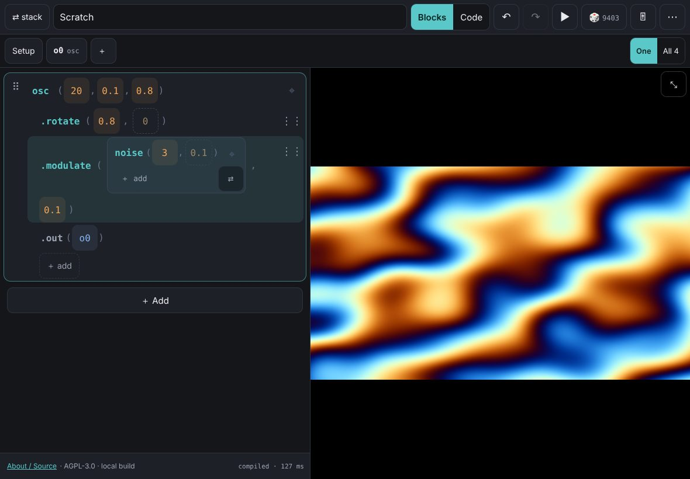 | 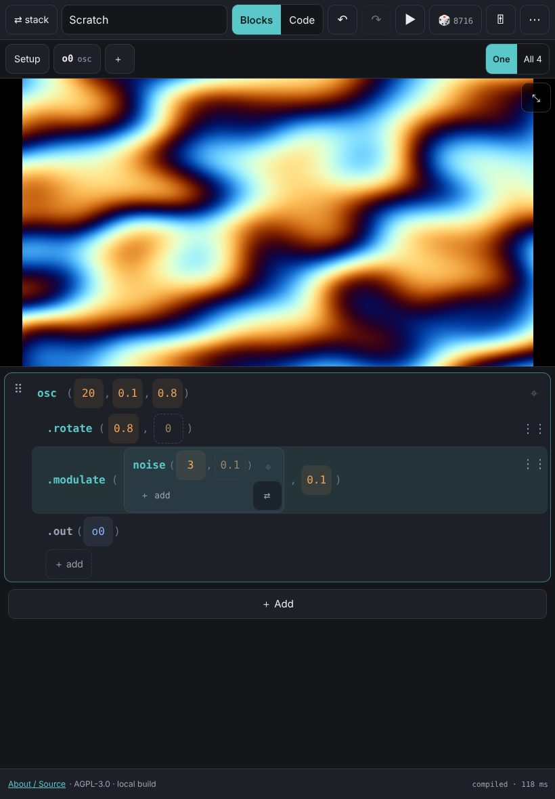 |
| 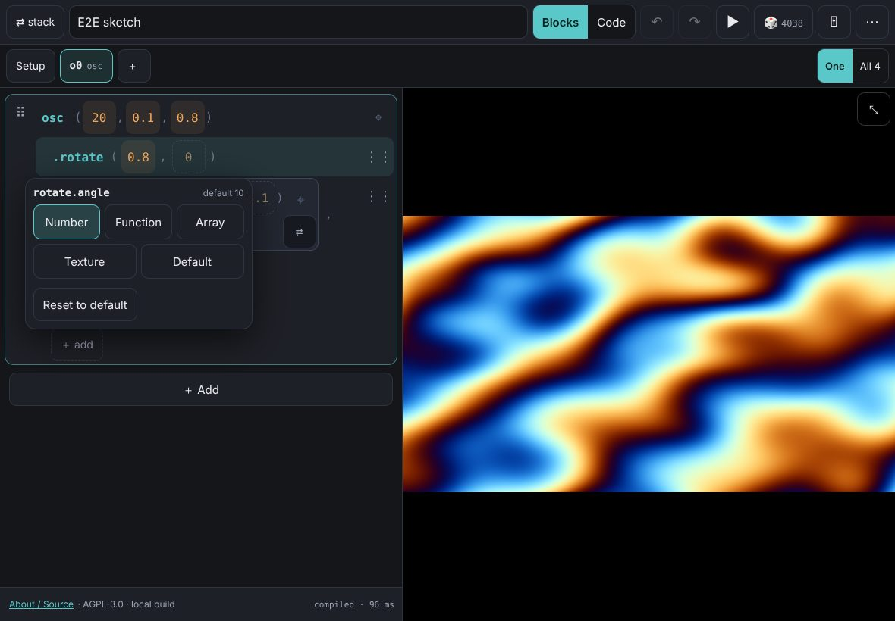 | 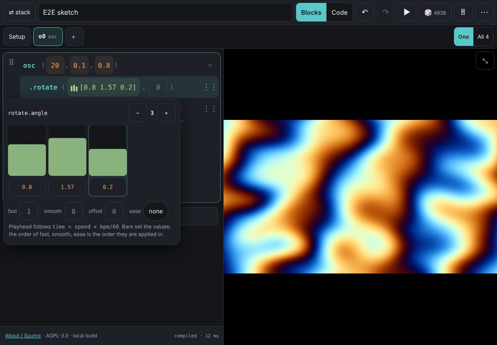 |
| 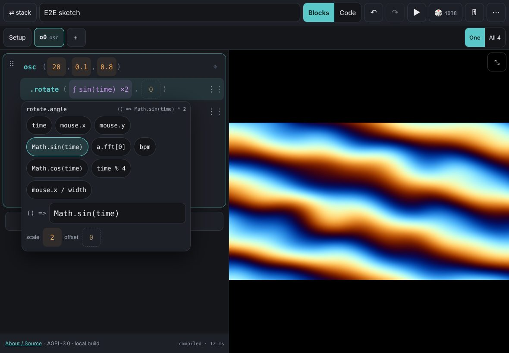 | 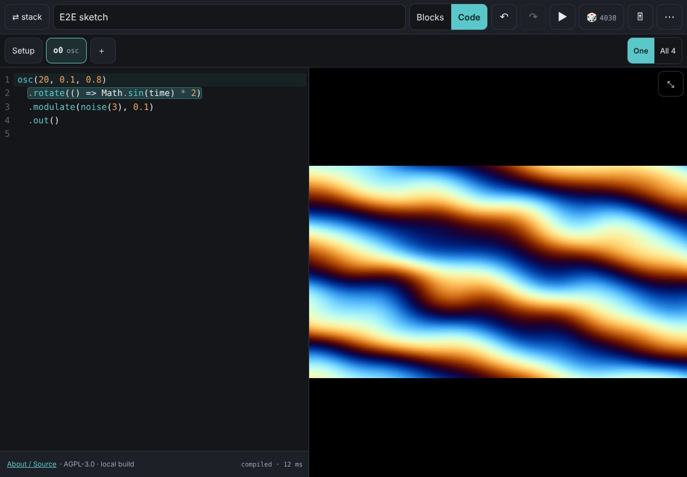 |
| 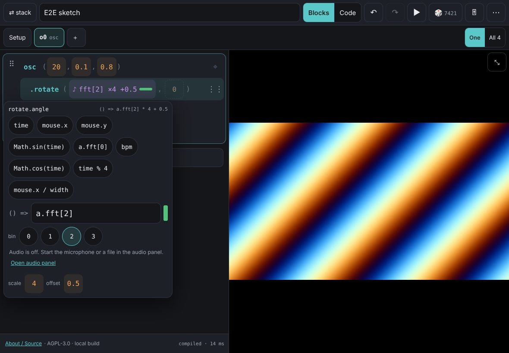 | 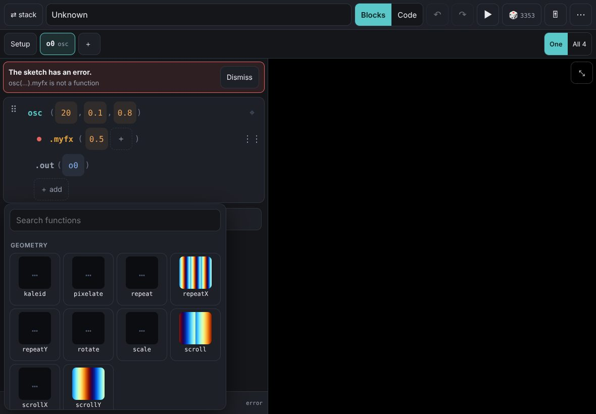 |
| 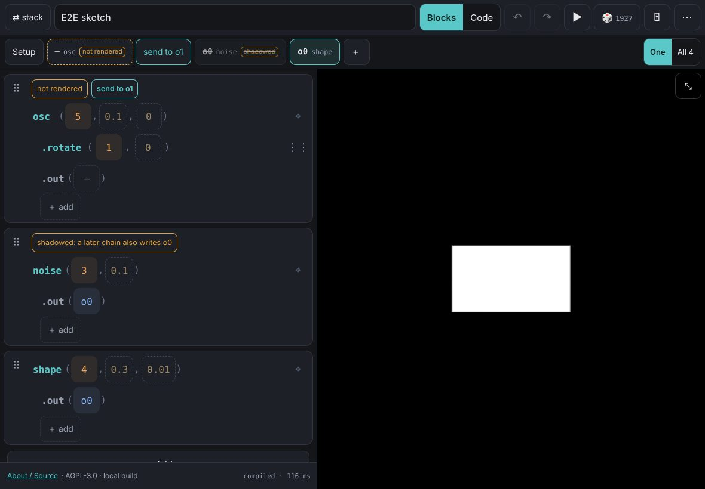 | 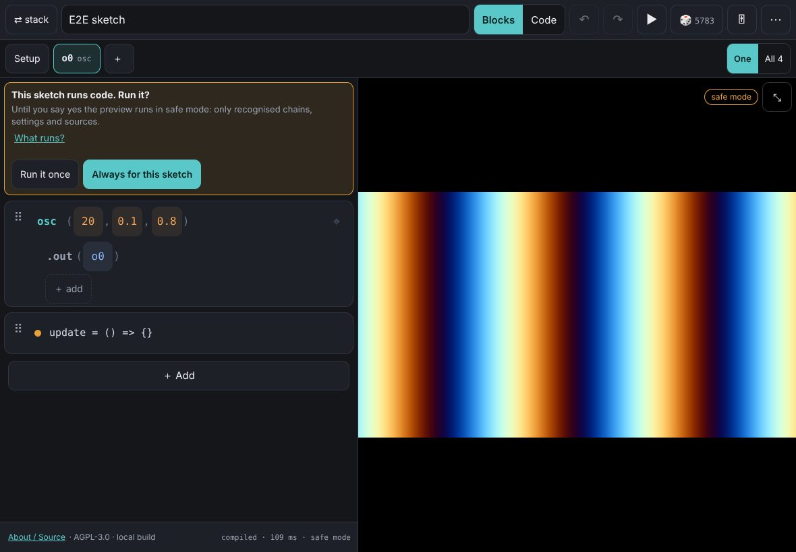 |
| 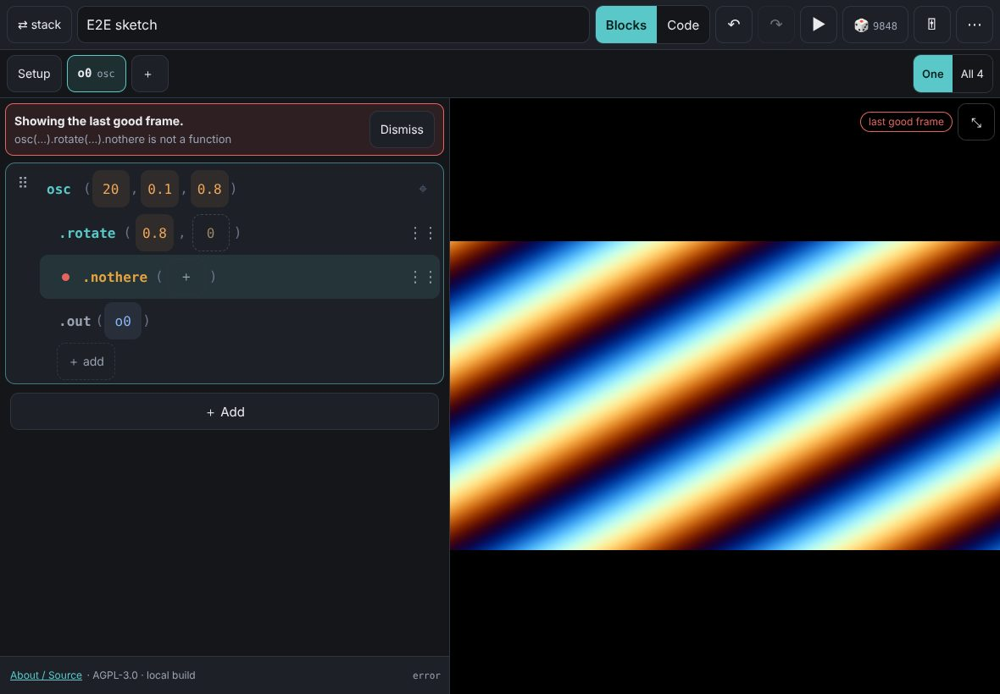 | 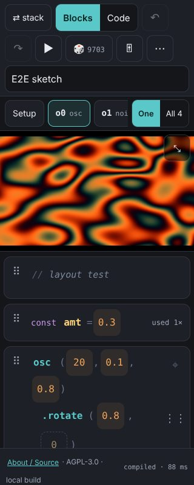 |
| 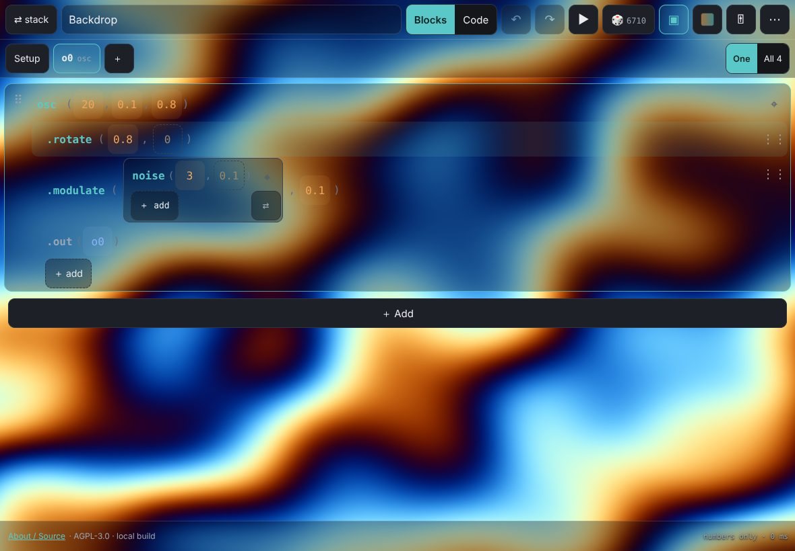 | 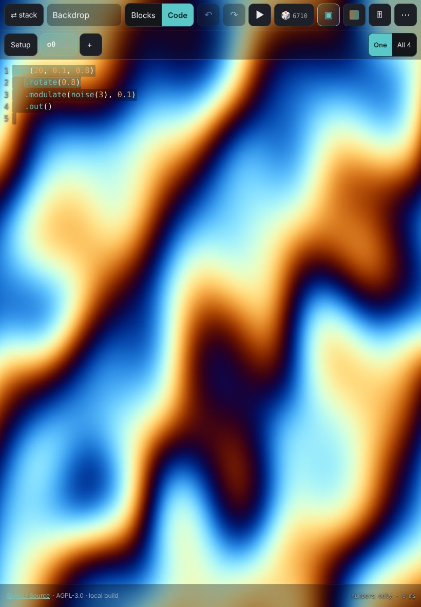 |

## Known issues

* **Not tested on an iPad.** Everything above is Chromium with emulated touch. Safari specifics (pointer-capture on touch, `touch-action`
  hand-off, container-query units for the 16:9 preview, the on-screen keyboard over popovers, iOS's own 3-finger edit gestures) are
  implemented from the platform docs, not observed.
* Editing a number inside a `def` that holds a chain re-lays that definition out (core regenerates it from scratch); on chains
  at statement level only the edited call's line changes.
* Dice replaces all statements (undoable, toast says the seed); mutate only touches the active chain.
* Renaming a variable follows `var` references in blocks, not text inside `raw` rows.
* Plugin functions are only listed once a plugin has been loaded by a sketch or the runtime; there is no plugin manager here.
* `s0.initCam()` / `initScreen()` cannot get permission inside the sandboxed frame; the banner offers a trust-gated switch to inline mode
  (not exercised with a real camera).
* The thumbnail runtime is a second WebGL context created on first use of the picker and disposed after 20 s idle.
* Two-finger / three-finger taps do nothing over the preview (a separate document).
* `meta.stack.rows` / `chains` record the view as built; the UI always renders from `sketch.stmts`, so they can lag behind later edits.
  Only `mode`, `active` and `renderMode` are read back.

## Core change requests (not made; listed in the PR)

1. `codegen.emitChainTopLike`: honour `call.src` / `chain.src` inside def-held chains, so one numeric edit changes one line there too.
2. Statement-level helpers (`insertStmt`, `moveStmt`, `removeStmt`) that repair `src.before`; editors currently each carry a copy (`model.respace`).
3. `runtime.run`: keep the previous outputs until the new evaluation has succeeded (today `resetForRun` blacks every output first,
   so an editor has to re-run the last good sketch to avoid a black preview).
4. Node attribution for runtime errors: `toRunnable` could return ids by line/column so thrown errors map to rows without guessing from the message.
5. A cheap clock for the array playhead (`rt.clock()` returning time, speed, bpm) instead of polling `rt.time()`.
6. Frame `allow="display-capture"` (or a quieter failure) for `initScreen()` sketches.

## What felt clumsy on touch, and what I would change

Honest caveat first: I never held this on an iPad. These are the rough edges I hit driving it with emulated touch at iPad sizes
and reading the screenshots; real fingers will find more.

1. **Rows wrap.** At 45 % width a four-argument call (`color`, `scroll`, `modulateScale` with a pocket) breaks over two or three
   lines and the `( … , … )` shape stops reading like code. 44 pt targets are the cost. *Change:* fold trailing default arguments
   behind a single `⋯` chip until touched; let the divider between stack and preview be dragged.
2. **A scrub has to start sideways.** Rows scroll vertically (`touch-action: pan-y`), so a drag that begins diagonally or downwards
   scrolls the list instead, and the "finer when the finger is lower" trick only works once the horizontal drag has begun. It is learnable
   but invisible. *Change:* a short press-and-hold that arms the scrub (like the reorder handle), or a first-use hint.
3. **Dim default arguments invite accidental edits.** Touching one turns it into an explicit argument (it disappears from the export
   again only when it is trailing and equal to the default). They also take the room that costs item 1. *Change:* see 1.
4. **Long-press is slow and silent.** 460 ms before the kind menu, no haptics in Safari, and it competes with the start of a slow
   scrub. The menu is a popover, not the radial menu the brief sketched, because a radial has to dodge screen edges and nested pockets.
   *Change:* a visible `⋯` affordance on the focused row, and a real radial for the five kinds.
5. **Popovers sit on top of what you are editing.** The keypad (≈ 270 × 400 pt) covers the three rows below the number; the function
   editor plus its keypad covers most of the stack in portrait. *Change:* dock the editors to the free half of the screen, or
   dim and push the stack instead of overlaying it.
6. **Pockets get cramped.** The nested rows only indent ≈ 10 pt, the `⇄` button (44 pt) sits over the pocket's `＋ add` row, and a
   pocket in a pocket in a pocket is hard to see. *Change:* depth-aware indentation and a pocket header line instead of a corner button.
7. **Multi-finger undo is fragile.** It cannot work over the preview (a different document), and on an iPad three fingers also mean the
   system's copy/paste/undo gestures. The buttons and ⌘Z are the reliable path.
8. **Thumbnails arrive one by one.** Software WebGL took ≈ 0.3 s per function, so the first picker shows a screen of `…`. A GPU will be
   faster but I could not measure it. *Change:* render them in idle time after load and cache them in IndexedDB.
9. **Two handles on one card.** `⠿` (statement) and `⋮⋮` (row) look alike and do different things. *Change:* only show the
   statement handle on long-press of the card background.
10. **Typing code on a glass keyboard is the slow path.** CodeMirror works, completion works, but there is no row of `( ) { } . , =>`
    above the on-screen keyboard. *Change:* add one.
11. **Setup is in two places.** The Setup sheet lists rows that are also in the stack. It is a shortcut, but a duplicate is a smell.
12. **Banners eat the small screens.** At 320 pt the trust banner plus an error banner take over 150 pt of the stack pane.
13. **The 16:9 preview letterboxes** in portrait Split View, wasting the top 40 %. *Change:* let the preview fill and crop, or shrink the pane to the picture.
